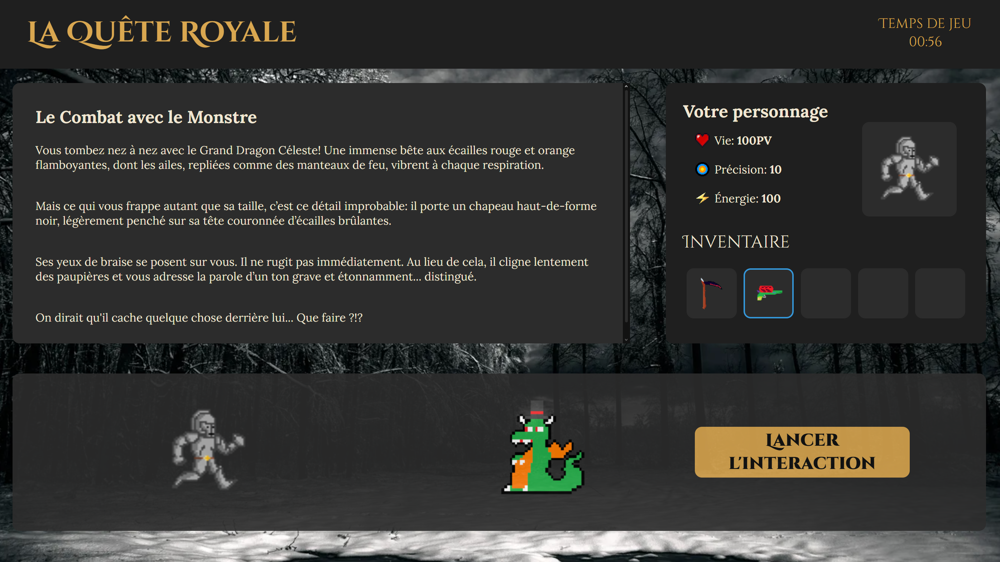

# Projet-C-CIR1

Notre projet de première année en C et HTML/CSS/JS est d'un livre intéractif numérique incluant un jeu avec des dialogues et des combats avec des personnages et des monstres.



# Sommaire

-   [Cahier des charges](#cahier-des-charges)
-   [Architecture du projet](#architecture-du-projet)
    -   [La partie C](#la-partie-c)
    -   [La partie Web](#la-partie-web)
-   [Construire le projet](#construire-le-projet)
    -   [Sur Windows](#sur-windows)
    -   [Sur Linux](#sur-linux)
-   [Utilisation](#utilisation)

# Cahier des charges

Voici les fonctionnalités principales que nous avons implémentées dans le projet:

**Partie minimale**

-   Livre intéractif avec différents chapitres.
-   Plusieurs choix possibles pour l'utilisateur qui redirigent vers d'autres chapitres.
-   Le site web est généré automatiquement à partir du code C en lisant le fichier `book.txt` et en écrivant les fichiers HTML dans le dossier `export`.

**Partie secondaire**

-   Interface web stylisée avec du CSS.
-   Page de garde (menu) pour sélectionner un livre.
-   Système de combat avec des monstres (tour par tour).
-   Inventaire pour stocker les différents objets/armes trouvés dans le livre.
-   Chaque arme possède des dégâts et une précision qui influe la possibilité de toucher un monstre.
-   Dialogues avec des personnages de l'aventure.
-   Casse-têtes à résoudre pour obtenir des objets puissants.
-   Easters eggs cachés dans le livre.
-   Système audio pour les musiques et les sons du jeu.

# Architecture du projet

Le projet est divisé en plusieurs fichiers et dossiers:

### La partie C

Cette partie s'occupe de la génération des chapitres du livre au format HTML en lisant depuis le fichier `book.txt`.
Cette partie génère une tableau de structures `Chapter` qui représentent les chapitres du fichier `book.txt`:

```c
struct Chapter {
    int id; //identifiant du chapitre
    char *title; //variable du titre du chapitre
    char **content; //tableau de textes
    int contentLen; //nombre de paragraphes
    struct Choice *choices; //tableau pour les choix
    int choiceLen; //nombre de choix disponibles
};

struct Choice {
    int chapNumber; //numéro du chapitre
    char *choicename; //texte du choix
};
```

-   `chapter.c` : contient les fonctions utilitaires liées à la structure `Chapter` ainsi que le tableau dynamique de chapitres.
-   `read_book.c` : contient les fonctions pour lire le fichier `book.txt` puis convertir chaque ligne pour générer la structure `Chapter` associée.
-   `write_html.c` : contient les fonctions pour copier le style CSS et le code JavaScript du dossier `web` puis pour écrire les fichiers HTML dans le dossier `export` à partir du tableau de chapitres.
-   `utils.c` : contient des fonctions utilitaires pour les chaînes de caractères.

### La partie Web

Cette partie contient le style CSS et le code JavaScript dans le dossier `web` pour l'interface web du livre interactif ainsi que la logique du jeu.

**Partie Statique**

`index.html` : il s'agit du menu principal de notre jeu.
`chapter.css` : c'est le fichier CSS qui stylise les pages HTML générées et les animations du jeu.

**Partie JavaScript**
Cette partie contient le code JavaScript pour gérer les interactions du jeu, les combats, les dialogues et les scénarios.
On peut facilement ajouter de nouveaux scénarios pour ajouter des intéractions aux chapitres du livre.

`game.js` : C'est le fichier qui gère le démarrage du jeu, l'intialisation des différents composants et la logique du jeu.

`gameEngine.js` : C'est le moteur du jeu, il gère toutes les mécaniques du jeu: les combats, les déplacements animés, l'inventaire et les musiques ainsi que tous les éléments graphiques du jeu (personnage, entités, coffres, etc...).

`gameStory.js` : C'est le fichier qui gère les scénarios du jeu, les dialogues et les choix de l'utilisateur. Il est possible d'ajouter de nouveaux scénarios, des entités et des objets en modifiant ce fichier.

Notre jeu utilise un tableau de scénarios pour ajouter les différentes intéractions à chaque chapitre du livre. Chaque scénario est un objet qui contient les informations nécessaires pour gérer les dialogues, les combats et les choix de l'utilisateur.
Voici un exemple de scénario:

```javascript
{
    //Le chapitre auquel appartient le scénario
    chapterId: 5,
    //Description du scénario
    description: "Le scénario de démonstration",
    // Indique si c'est un combat ou non
    isFight: false,
    // Fonction qui s'exécute avant le démarrage de l'interaction (mise en place des entités, etc.)
    preScenario: () => {
      spawnEntity("personnage1");
    },
    // Le texte de discussion avant le choix du joueur
    beforeChoiceDiscussionText: `Bonjour jeune aventurier.
        Je suis là pour te mettre au défi :
        Pourras-tu résoudre ce Casse tête et passer cette épreuve ?
        Quel est le résultat de 99*17-85/5 ?
        `,
    // Les choix disponibles pour le joueur
    choices: [
      {
        text: "Résoudre",
        // Fonction qui s'exécute lors du choix
        onClick: () => {
        },
        // Bulle de texte affiché après la discussion pour ce choix
        afterDiscussionText: "",
      },
      {
        text: "Attaquer",
        onClick: () => {
        },
        afterDiscussionText:
          "C'est dommage, tu aurais pu gagner un item, c'était pourtant trivial !",
      },
    ],
  }
```

# Construire le projet

### Sur Windows

1. Ouvrir le dossier du projet avec CLion puis lancer la compilation.
2. Vous pouvez maintenant accéder au dossier `export` dans le dossier du projet pour ouvrir le site web généré.

### Sur Linux

1. Créer un dossier `build` dans le dossier du projet.

```bash
mkdir build
```

2. Lancer la compilation dans le dossier `build`.

```bash
cd build
cmake ..
make
```

3. Lancer le projet pour générer les fichiers HTML/CSS/JS.

```bash
./Projet-C-CIR1
```

**Il faut bien faire attention à lancer le projet depuis le dossier `build` pour que les fichiers HTML/CSS/JS soient
trouvés depuis la fonction writeHTML**

# Utilisation

Pour accéder à l'interface web générée par le code de l'application:

1. Ouvrir le dossier `export` dans le dossier du projet.
2. Ouvrir le fichier `index.html` dans un navigateur web.
